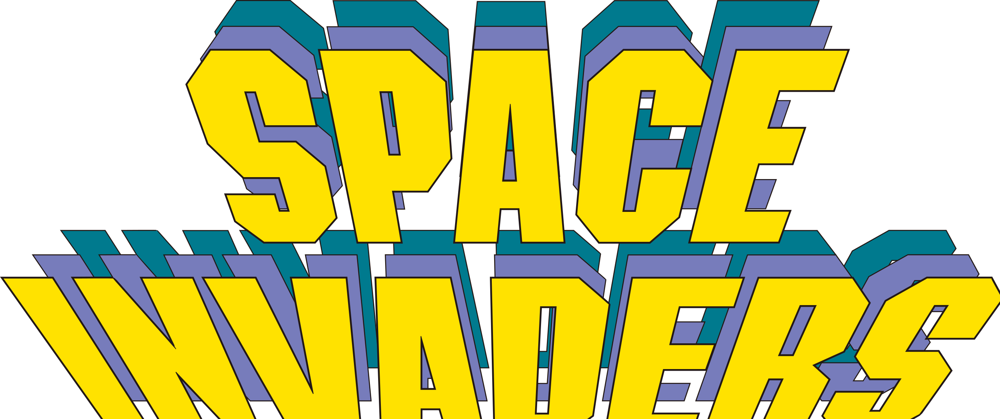

<a name="readme-top"></a>

<!-- PROJECT SHIELDS -->
[![Forks][forks-shield]][forks-url]
[![Stargazers][stars-shield]][stars-url]
[![Issues][issues-shield]][issues-url]
[![MIT License][license-shield]][license-url]
[![LinkedIn][linkedin-shield]][linkedin-url]


<!-- PROJECT LOGO -->
<br />
<div align="center">
  <a href="https://github.com/FowwazM/Space-Invader">
    
  </a>

<h3 align="center">Space Invader (Recreation)</h3>

  <p align="center">
    This is a recreation of the popular game 'Space Invader' made in Python.
    <br />
    <a href="https://github.com/FowwazM/Space-Invader"><strong>Explore the docs »</strong></a>
    <br />
    <br />
    <a href="https://github.com/FowwazM/Space-Invader/issues">Report Bug</a>
    ·
    <a href="https://github.com/FowwazM/Space-Invader/issues">Request Feature</a>
  </p>
</div>


<!-- TABLE OF CONTENTS -->
<details>
  <summary>Table of Contents</summary>
  <ol>
    <li>
      <a href="#about-the-project">About The Project</a>
    </li>
    <li>
      <a href="#getting-started">Getting Started</a>
      <ul>
        <li><a href="#prerequisites">Prerequisites</a></li>
        <li><a href="#installation">Installation</a></li>
      </ul>
    </li>
    <li><a href="#roadmap">Roadmap</a></li>
    <li><a href="#license">License</a></li>
    <li><a href="#contact">Contact</a></li>
  </ol>
</details>


<!-- ABOUT THE PROJECT -->
## About The Project

![Product Name Screen Shot][product-screenshot]

This is a recreation of the popular game 'Space Invader' in Python using the Pygame library. I have to create proper graphics for the game. I may add an AI player or AI aliens in the future, but this isn't a planned feature. Credits for the music can be found in [attributions.txt](https://github.com/FowwazM/Space-Invader/blob/main/Audio/attributions.txt)

<p align="right">(<a href="#readme-top">back to top</a>)</p>


<!-- GETTING STARTED -->
## Getting Started

To get a local copy up and running follow these simple steps.

### Prerequisites

Ensure you have Python installed on your system from the [official site](https://www.python.org/downloads/).

Install the Pygame library to your system:
```sh
pip install pygame
```

### Installation

1. Clone the repo
   ```sh
   git clone https://github.com/FowwazM/Space-Invader.git
   ```
2. Navigate to [main.py](https://github.com/FowwazM/Space-Invader/blob/main/Code/main.py)
   ```sh
   ../Space-Invader/Code/main.py
   ```
3. Run the file to play the game

<p align="right">(<a href="#readme-top">back to top</a>)</p>


<!-- ROADMAP -->
## Roadmap

- [ ] Improved Graphics
    - [ ] Add a CRT screen overlay
    - [ ] Create new player and alien sprites
- [ ] Player Sprite Selection
- [ ] Create an infinite game-mode

See the [open issues](https://github.com/FowwazM/Space-Invader/issues) for a full list of proposed features (and known issues).

<p align="right">(<a href="#readme-top">back to top</a>)</p>


<!-- LICENSE -->
## License

Distributed under the GPL-3.0 License. See `LICENSE.txt` for more information.

<p align="right">(<a href="#readme-top">back to top</a>)</p>


<!-- CONTACT -->
## Contact

Fowwaz Moeen - [LinkedIn][linkedin-url] - fowwazmoeen@gmail.com

Project Link: [https://github.com/FowwazM/Space-Invader](https://github.com/FowwazM/Space-Invader)

<p align="right">(<a href="#readme-top">back to top</a>)</p>

<!-- MARKDOWN LINKS & IMAGES -->
<!-- https://www.markdownguide.org/basic-syntax/#reference-style-links -->
[forks-shield]: https://img.shields.io/github/forks/FowwazM/Space-Invader.svg?style=for-the-badge
[forks-url]: https://github.com/FowwazM/Space-Invader/network/members
[stars-shield]: https://img.shields.io/github/stars/FowwazM/Space-Invader.svg?style=for-the-badge
[stars-url]: https://github.com/FowwazM/Space-Invader/stargazers
[issues-shield]: https://img.shields.io/github/issues/FowwazM/Space-Invader.svg?style=for-the-badge
[issues-url]: https://github.com/FowwazM/Space-Invader/issues
[license-shield]: https://img.shields.io/github/license/FowwazM/Space-Invader.svg?label=license&style=for-the-badge
[license-url]: https://github.com/FowwazM/Space-Invader/blob/main/LICENSE.txt
[linkedin-shield]: https://img.shields.io/badge/-LinkedIn-black.svg?style=for-the-badge&logo=linkedin&colorB=555
[linkedin-url]: https://www.linkedin.com/in/fowwaz-moeen/
[product-screenshot]: Docs/screenshot.png
[Next.js]: https://img.shields.io/badge/next.js-000000?style=for-the-badge&logo=nextdotjs&logoColor=white
[Next-url]: https://nextjs.org/
[React.js]: https://img.shields.io/badge/React-20232A?style=for-the-badge&logo=react&logoColor=61DAFB
[React-url]: https://reactjs.org/
[Vue.js]: https://img.shields.io/badge/Vue.js-35495E?style=for-the-badge&logo=vuedotjs&logoColor=4FC08D
[Vue-url]: https://vuejs.org/
[Angular.io]: https://img.shields.io/badge/Angular-DD0031?style=for-the-badge&logo=angular&logoColor=white
[Angular-url]: https://angular.io/
[Svelte.dev]: https://img.shields.io/badge/Svelte-4A4A55?style=for-the-badge&logo=svelte&logoColor=FF3E00
[Svelte-url]: https://svelte.dev/
[Laravel.com]: https://img.shields.io/badge/Laravel-FF2D20?style=for-the-badge&logo=laravel&logoColor=white
[Laravel-url]: https://laravel.com
[Bootstrap.com]: https://img.shields.io/badge/Bootstrap-563D7C?style=for-the-badge&logo=bootstrap&logoColor=white
[Bootstrap-url]: https://getbootstrap.com
[JQuery.com]: https://img.shields.io/badge/jQuery-0769AD?style=for-the-badge&logo=jquery&logoColor=white
[JQuery-url]: https://jquery.com 